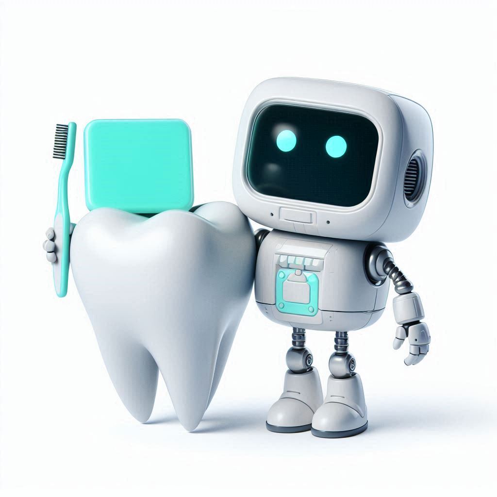

# Dentibot: AI-Powered Dental Invoice Assistant

Dentibot is an AI chatbot designed to help users analyze, explain, and answer questions about dental invoices with ease and accuracy.

## Features

- **AI-Powered**: Dentibot leverages the capabilities of [Anthropic Claude](https://www.anthropic.com/product) as its language model, integrated via AWS Bedrock. Knowledge base is trained on the current information of [KNMT](https://knmt.nl/), which is stored in a [Pinecone](https://www.pinecone.io/) vectordatabase
- **Serverless Architecture**: Both the frontend and backend are fully serverless, ensuring scalability and reliability. The entire infrastructure is deployed using AWS CloudFormation.
- **Live Demo**: Explore Dentibot in action at [dentibot.nl](https://dentibot.nl).

